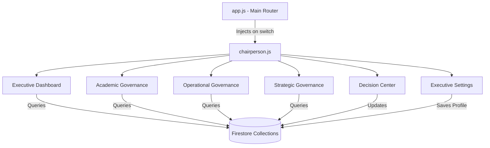

# Chairperson Executive Center Redesign: Architectural Specification

This document serves as the master architectural blueprint and implementation plan for the **Chairperson Executive Center Redesign**, aligning the system with [updated_chairperson_redesign.md](file:///home/moondae/Antigravity%20Projects/DoC%20Learning%20Hub/updated_chairperson_redesign.md) and [Department of Chemistry Master Implementation Roadmap.md](file:///home/moondae/Antigravity%20Projects/DoC%20Learning%20Hub/Department%20of%20Chemistry%20Master%20Implementation%20Roadmap.md).

---

## 🔍 1. Alignment & Gap Analysis

Our previous implementation plan was a basic tabbed panel. The new vision transforms this into an **Executive Command Layer**. The following gaps, conflicts, and restructuring recommendations have been identified:

### Key Differences & Gaps:
1.  **Faculty Oversight**: Expanded from basic rosters/load details to a multi-faceted dashboard mapping: *teaching load, consultation schedules, research logs, extension/outreach projects, accreditation tasks, instructional materials checklist, attendance reviews, evaluations, and accomplishment reports*.
2.  **PCO/EMIS Boundaries**: Restricted to **office-generated hazardous waste only** (e.g. printer toners, e-waste, office spent materials). Laboratory chemical waste remains under the LIMS Stockroom module.
3.  **Strategic Planning**: Expanded from a simple checklist to 8 distinct monitoring boards: *VMGO, 5-Year Plan, AOP, Procurement, Faculty Development, Lab Development, Risk Register, and KPI monitors*.
4.  **Decision Center Approvals**: Shifted from simple class creation checks to a centralized action inbox covering: *procurement, curriculum, leaves, laboratory purchases, equipment disposal, chemical purchases, and administrative documents*.
5.  **Department Health Index (DHI)**: Transitioned from hardcoded calculations to a **user-configurable weighting system** managed via settings, with new default weights:
    *   Student Progress: **35%**
    *   Faculty Performance: **20%**
    *   Laboratory Operations: **20%**
    *   Environmental Compliance: **15%**
    *   Strategic Planning: **10%**

### Architect Recommendations:
*   **Split-Panel Layout**: Implement a left-hand local sub-navigation menu for the Chairperson Center, grouping the 10 screens into four functional areas: *Executive Dashboard, Academic Governance, Operational Governance, and Strategic Governance*.
*   **Settings Persistence**: Store the DHI configured weights directly in a new Firestore document `/config/health_index` so that updates reflect globally and persist across sessions.
*   **Document Repository**: Integrate a read-only view of `/requisitions` attachments and `/pco_permits` PDFs as a unified Document Repository.

---

## 🏛️ 2. Chairperson Master Implementation Plan

### Overall Architecture
The Chairperson Center runs as a dynamically loaded sub-module (`chairperson.js`) to keep the primary script (`app.js`) performant. It interacts with the existing Firestore layout and loads shared services.



### Overall Workflows
1.  **Syllabus & Material Audits**:
    *   *Trigger*: Faculty uploads syllabus PDF or updates checklist.
    *   *Processor*: `chairperson.js` queries `/classes` and displays progress flags.
2.  **Central Decision Approvals**:
    *   *Trigger*: Faculty or PCO submits an approval document (leave, procurement, chemical purchase).
    *   *Action*: Chairperson reviews attachments, adds dynamic remarks, signs off with their uploaded Base64 digital signature, and writes `status: "approved_by_chairperson"` to Firestore.
3.  **Department Health Index Real-time Calculation**:
    *   *Calculation*: `DHI = (Student_Prog * w1) + (Faculty_Perf * w2) + (Lab_Ops * w3) + (Env_Comp * w4) + (Strat_Plan * w5)`
    *   *Updates*: Saving new weights in settings recalculates and re-renders the circular gauges instantly.

---

## 🗂️ 3. Information Architecture & Screen Blueprint

### Navigation Tree & Sub-Tabs
```
🏛️ Chairperson Executive Center
 ├── 📊 Executive Dashboard (Health Index, KPI Cards, Pending Approvals, Calendar)
 ├── 🎓 Academic Governance
 │    ├── 📋 Academic Affairs (Course registries & syllabus audits)
 │    ├── 📚 Curriculum Management (Greyed Out / Coming Soon)
 │    ├── 👨‍🏫 Faculty Oversight (Teaching, Consultation, Research, Extensions, Accreditation, Attendance)
 │    └── 👨‍🎓 Student Oversight (Roster metrics, checklist rates, grade midpoints)
 ├── ⚙️ Operational Governance
 │    ├── 🧪 Laboratory Oversight (LIMS ledger, requisitions summary - Read-Only)
 │    └── 🌿 PCO/EMIS Oversight (Office-generated waste carboys, Opacity logs)
 ├── 📈 Strategic Governance
 │    ├── 💡 Strategic Planning (VMGO, 5-Year Plan, AOP, Risk Registers)
 │    ├── 📄 Executive Reports (Faculty, Lab, PCO, Student, and Executive sections)
 │    └── 📅 Executive Calendar (Reminders, recurring events, task files)
 ├── 🔔 Decision Center
 │    ├── ✍️ Executive Approvals (Procurement, leave, disposal reviews)
 │    └── 📢 Executive Notifications (System alerts and compliance reminders)
 └── ⚙️ Executive Settings
      ├── 🎨 Dashboard Config (Health index weight configuration)
      ├── 🔔 Notification Config (Threshold sliders)
      └── ✍️ Digital Signature (Signature image uploader)
```

---

## ⚙️ 4. Functional Specification

### Screen 1: Executive Dashboard
*   **Field: Department Health Index Gauge**: Centered circular HSL gauge detailing overall percentage.
*   **KPI Cards**:
    *   *Roster Card*: Total students enrolled.
    *   *Faculty Card*: Total faculty members.
    *   *Clearance Card*: LIMS clearance rate.
    *   *PCO Card*: Compliance metric (spills, carboy storage limits).
*   **Pending Approvals Widget**: Actionable list of the latest class requests and leave applications.
*   **Permissions**: Read-only dashboard elements; buttons link to respective sub-views.

### Screen 2: Academic Governance
*   **Syllabus Audit Table**: Lists courses, instructors, sections, and checklist updates.
*   **Faculty Oversight Sub-tabs**:
    *   *Teaching Loads*: Table of teaching units.
    *   *Consultation Hours*: Renders consultation slots.
    *   *Research & Extension Logs*: Renders research items.
    *   *Instructional Materials*: Checks syllabus PDF presence.
*   **Student Oversight Histograms**: HTML/CSS flexbox histograms graphing grade distributions and notes checklists completion.

### Screen 3: Operational Governance (LIMS & PCO)
*   **Laboratory Oversight (Read-Only)**: Renders requisitions ledger, outstanding student accountability entries.
    *   *Constraint*: Action dropdowns disabled; clearance overrides restricted to laboratory account.
*   **PCO/EMIS Oversight (Office Waste Only)**:
    *   *Carboy Grid*: Volumetric gauges monitoring office-generated spent toners, e-waste, and mercury cells.
    *   *spills/incidents logs*: Spills registry for offices.

### Screen 4: Strategic Governance
*   **Milestones List (VMGO, AOP, Risk Register)**: Expandable panels mapping strategic items (e.g. Level 1 Accreditation prep). Interactive checkboxes commit completion states to Firestore `/config/strategic_milestones`.
*   **Executive Reports**: Separated sections (Faculty, Lab, PCO, Student, Executive). Tapping "Export CSV" generates files.
*   **Executive Calendar**: Interactive calendar grid with task attachments.

### Screen 5: Decision Center (Approvals)
*   **Approvals Queue**: Interactive list of requests:
    *   Class creation requests.
    *   Procurement, chemical purchases, equipment disposal, leave applications.
*   **Action buttons**: Approve (places Base64 digital signature and writes approval), Deny (requires rejection remarks).

### Screen 6: Executive Settings
*   **DHI Slider Configurations**: Five range input sliders (0-100%) for Student, Faculty, Lab, PCO, and Strategic.
    *   *Validation*: The sum of all weights must equal exactly 100%. If sum $\neq 100$, display a warning badge and disable the save button.
*   **Digital Signature Upload**: Image selector converting PNG to Base64, showing preview card on save.

---

## 🗄️ 5. Firestore Database Architecture

To support the redesigned workflows, the database structure is detailed below:

### 1. Document: `/config/health_index`
Stores the weights used to compute the Department Health Index:
```json
{
  "studentProgressWeight": 35,
  "facultyPerformanceWeight": 20,
  "laboratoryOperationsWeight": 20,
  "environmentalComplianceWeight": 15,
  "strategicPlanningWeight": 10,
  "lastUpdatedBy": "chairperson@msugensan.edu.ph",
  "updatedAt": "2026-06-28T14:40:00Z"
}
```

### 2. Document: `/config/strategic_milestones`
Stores checked states for VMGO, 5-Year Plan, AOP, Risk Register, etc.:
```json
{
  "milestones": {
    "vmgo_review_2026": { "title": "Review VMGO alignment", "status": "completed", "updatedBy": "chairperson@msugensan.edu.ph" },
    "aop_draft_submitted": { "title": "Submit AOP draft", "status": "pending", "updatedBy": null },
    "procurement_order_01": { "title": "Accreditation equipment procurement", "status": "pending", "updatedBy": null }
  }
}
```

### 3. Collection: `/approvals`
Tracks documents, procurement requests, leaves, and chemical purchases submitted to the Chairperson:
```json
{
  "approvalId": "APP-PROC-2026-004",
  "type": "procurement", // "procurement", "curriculum", "leave", "lab_purchase", "disposal", "chemical_purchase", "document"
  "title": "Purchase of Spectrophotometer Reagents",
  "description": "Requisition of chemicals for Inorganic Lab sections.",
  "requestedBy": "faculty_member@msugensan.edu.ph",
  "requestedByName": "Prof. Ramon M. Eduque, Jr.",
  "dateSubmitted": "2026-06-28T09:00:00Z",
  "status": "pending", // "pending", "approved_by_chairperson", "denied"
  "attachmentUrl": "gs://doc-learning-hub.appspot.com/approvals/req_reagents_2026.pdf",
  "remarks": null,
  "signedBy": null, // Base64 signature copy or reference
  "timestamp": "2026-06-28T09:00:00Z"
}
```

---

## 🎨 6. UI/UX Design System

### HSL Visual Tokens
```css
/* Chairperson Theme Elements */
.chairperson-panel {
  --accent: hsl(348, 83%, 47%);
  --accent-glow: hsla(348, 83%, 47%, 0.15);
  --border-card: rgba(255, 255, 255, 0.06);
  --bg-card: rgba(15, 23, 42, 0.45);
}

.cp-glass-card {
  background: var(--bg-card);
  border: 1px solid var(--border-card);
  backdrop-filter: blur(16px);
  border-radius: 20px;
  box-shadow: 0 8px 32px rgba(0,0,0,0.2);
}
```

### Conic-Gradient Circular Gauge
Renders the Department Health Index using inline SVG configurations for precision:
```html
<svg width="120" height="120" viewBox="0 0 120 120">
  <circle cx="60" cy="60" r="50" fill="none" stroke="rgba(255,255,255,0.03)" stroke-width="8" />
  <circle cx="60" cy="60" r="50" fill="none" stroke="var(--cp-primary)" stroke-width="8" 
          stroke-dasharray="314" stroke-dashoffset="78.5" stroke-linecap="round" transform="rotate(-90 60 60)" />
</svg>
```

---

## 🧩 7. JavaScript Module Architecture

### `chairperson.js` Structure
*   **State Manager**: Caches query results and manages weight totals.
*   **Sub-renderers**:
    *   `renderCPDashboard()`: Pulls configurations and aggregates indicators.
    *   `renderCPAcademic()`: Renders classroom matrices and filters.
    *   `renderCPFaculty()`: Multi-tab layout for faculty parameters.
    *   `renderCPOperations()`: Restricts LIMS overrides; loads office PCO ledger.
    *   `renderCPStrategic()`: Strategic timeline checklists.
    *   `renderCPReports()`: Export modules.
    *   `renderCPApprovals()`: Approvals queue.
    *   `renderCPSettings()`: Weight sliders and signature uploader.
*   **Approvals Action Controller**: Manages `updateApprovalStatus(id, action, remarks)`.

---

## 🛠️ 8. Development & Testing Sequence

### Development Steps:
1.  **Step 1**: Write `/config` strategic milestones and DHI schemas to Firestore.
2.  **Step 2**: Modify `index.css` to add the Crimson HSL variable variables and glassmorphism.
3.  **Step 3**: Rewrite `chairperson.js` to implement the Split-View sidebar layout and the 10 screen controllers.
4.  **Step 4**: Integrate Settings DHI sliders and the signature image uploader.
5.  **Step 5**: Set up test mock accounts for chairperson testing.
6.  **Step 6**: Run syntactic validator and brackets balance checks.

### Testing Gate Checks:
1.  **DHI Total Validation**: Verify that configuring weights to total 102% prevents saving and shows a validation error badge.
2.  **Class Creation approvals**: Confirm class approvals sync in both Admin and Chairperson viewports in real-time.
3.  **LIMS Read-Only Lock**: Log in as Chairperson, open the stockroom ledger, and confirm that all override actions are disabled.
